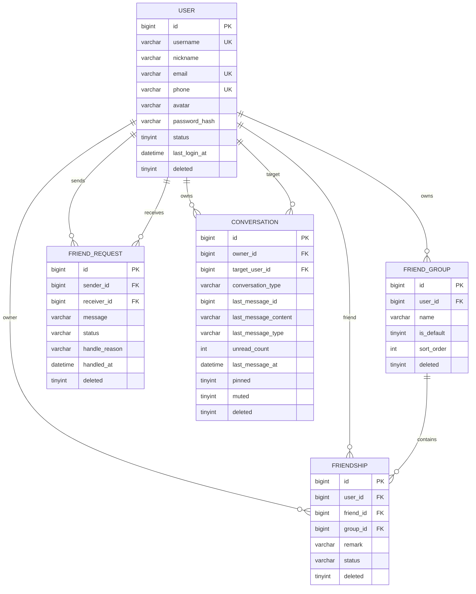

# ER图设计说明

## ER图

## 设计说明

- `user` 是系统用户主表，用户名、邮箱、手机号独立唯一索引，支持逻辑删除和账号禁用。
- `friend_group` 是用户侧分组表，每个用户注册或登录时自动保证存在一个 `默认分组`。
- `friendship` 使用用户侧有向关系保存好友，A 和 B 成为好友后写入两条记录，因此双方可以维护各自独立的备注和分组。
- `friend_request` 保存好友申请状态，状态为 `PENDING`、`ACCEPTED`、`REJECTED`，同意后由服务层双向写入 `friendship`。
- `conversation` 是消息列表/最近会话表，直接维护最后一条消息内容、最后消息时间和未读数，查询按 `pinned DESC, last_message_at DESC` 排序。
- 所有业务表都有 `deleted` 逻辑删除字段，并围绕查询条件设计组合索引，避免好友列表、申请列表和最近会话列表出现全表扫描。
